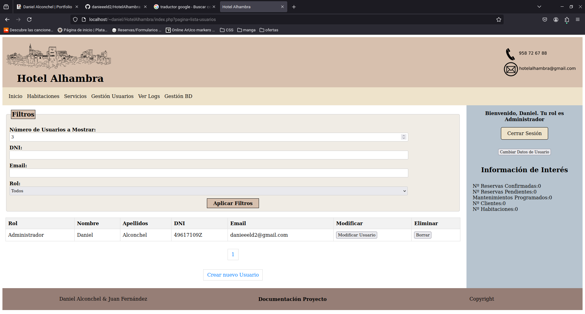

Online website for a ficticius hotel designed for the subject of Web Technologies at the University of Granada.

All the information about technologies used and the implementation of the BD is on the github link bellow.

<pre>
The main tools used were:
  - HTML
  - CSS
  - PHP
  - SQL
  - No framework is used for this project
</pre>

All the information about the project can be found in the following link: <a href="https://github.com/danieeeld2/HotelAlhambra"><i class="large github icon "></i>HotelAlhambra</a>

