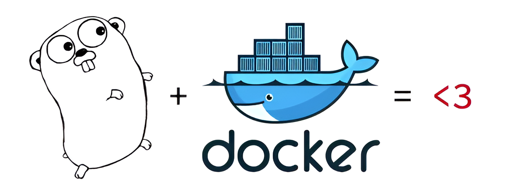

First time carrying out a continuous integration project, with the Go language and the use of GitHub.

This project was prepared for a university subject, but all the ideas and decision-making are my own, without influence from the professor.

<pre>
The development of this project was very interesting, since, 
although it may seem strange, in the computer science degree (at the 
University of Granada) there are no subjects where free decision-making 
is allowed (they are all with a very closed script) and neither
tools like GitHub are used.

This is a very unique subject, different from any other in the degree, where 
you have total freedom, so you acquire much more knowledge than in any other, 
apart from the fact that it is more fun.

Some of the knowledge learned is:
  - GitHub Issues, Pull Requests, Reviews and Actions
  - Collaborative work
  - Tool choice
  - Testing
  - Docker and DockerHub
  - Automatization
  - CI Tools
  - Correct project configuration
  - API REST
</pre>

All the information about the project can be found in the following link: <a href="https://github.com/danieeeld2/LogisticsRoutes"><i class="large github icon "></i>Logistics Routes</a>
